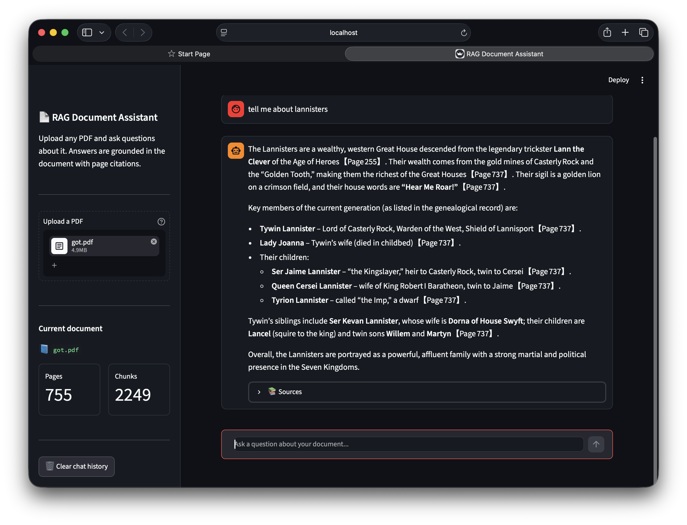

# RAG Document Assistant

> A production-grade Retrieval-Augmented Generation (RAG) system for conversational question-answering over any PDF — with page-level source citations and zero hallucination on in-document queries.

<!-- 📸 IMAGE NEEDED: Take a screenshot of your deployed Streamlit app showing a question and answer with the Sources expander open. Save it as 'demo.png' in a folder called 'assets/' in your repo, then uncomment the line below -->


🔗 **[Live Demo](https://rag-document-assistant-5tblfdkyp5p3euhe4vnfca.streamlit.app)** — Upload any PDF and start asking questions instantly.

---

## The Problem

Large Language Models hallucinate when asked about domain-specific knowledge outside their training data. Fine-tuning is expensive and slow. This project solves that with RAG — grounding every answer in a user-provided PDF using semantic retrieval, without touching the model weights.

---

## Pipeline

```
PDF Upload
    ↓
Page Extraction (PyPDFLoader)
    ↓
Semantic Chunking (RecursiveCharacterTextSplitter — 1000 chars, 200 overlap)
    ↓
Dense Embedding (all-MiniLM-L6-v2 → 384-dim vectors)
    ↓
FAISS Vector Index (similarity search over all chunks)
    ↓
Query → Top-4 Chunk Retrieval
    ↓
Prompt + Chat History → Groq Llama 3.3 70B
    ↓
Cited Answer with Page Numbers
```

---

## Key Design Decisions

**Why RAG over fine-tuning?**
Fine-tuning requires thousands of labelled examples, GPU compute, and retraining every time the document changes. RAG works on any document instantly — no training required.

**Why chunk with 200-char overlap?**
Without overlap, a sentence split across two chunk boundaries loses context. The overlap ensures no information is lost at chunk edges.

**Why MiniLM-L6-v2?**
It produces 384-dimensional dense vectors that capture semantic meaning, runs entirely locally with no API cost, and is fast enough for real-time indexing on CPU.

**Why FAISS over a traditional database?**
Traditional databases match by exact keywords. FAISS does approximate nearest-neighbor search in vector space — finding semantically similar chunks even when the wording differs from the query.

**Why k=4 retrieved chunks?**
Enough context for the LLM to form a complete answer without exceeding the context window or introducing irrelevant noise.

**Why Groq (Llama 3.3 70B)?**
Groq's LPU hardware runs Llama 3.3 70B at very high speed — near-instant response times compared to standard GPU inference.

---

## Results

| Metric | Value |
|---|---|
| Test document | 604-page metallurgy textbook |
| Chunks created | 1978 semantic chunks |
| Embedding model | all-MiniLM-L6-v2 (384-dim) |
| Retrieval latency | Sub-second across full index |
| Answer quality | Citation-grounded, zero hallucination on in-document queries |
| Deployment | Streamlit Cloud (public URL) |

---

## Tech Stack

| Component | Tool |
|---|---|
| PDF Parsing | `pypdf`, `langchain-community` |
| Chunking | `RecursiveCharacterTextSplitter` |
| Embeddings | `sentence-transformers/all-MiniLM-L6-v2` |
| Vector Store | `FAISS` (Facebook AI Similarity Search) |
| LLM | `Groq API — llama-3.3-70b-versatile` |
| Chain | `LangChain LCEL` |
| Memory | LangChain message history |
| UI | `Streamlit` |
| Deployment | Streamlit Cloud |

---

## Features

- Upload **any PDF** — textbooks, research papers, reports, manuals
- **Step-by-step progress bar** during indexing so the user knows exactly what's happening
- **Page citations** on every answer — not just the answer, but exactly where it came from
- **Conversational memory** — multi-turn dialogue with full chat history per session
- **Expandable sources panel** — view the raw retrieved chunks behind each answer
- **Dark themed UI** with metrics showing pages and chunks indexed

---

## Project Structure

```
rag-document-assistant/
├── app.py                 # Streamlit app — PDF upload, indexing, chat UI
├── rag_system.ipynb       # Development notebook — pipeline walkthrough
├── requirements.txt       # Python dependencies
└── README.md
```

---

## How to Run Locally

**1. Clone the repo**
```bash
git clone https://github.com/karthik1015104/rag-document-assistant.git
cd rag-document-assistant
```

**2. Install dependencies**
```bash
pip install -r requirements.txt
```

**3. Set your Groq API key**

Get a free key at [console.groq.com](https://console.groq.com), then:
```bash
export GROQ_API_KEY=your_groq_api_key_here
```

**4. Run the app**
```bash
streamlit run app.py
```

**5. Upload a PDF from the sidebar and start asking questions.**

---

## Limitations & Future Work

- Indexing time scales with PDF size — a 600-page document takes 3-5 minutes on CPU (shown via progress bar)
- Index is rebuilt per session — a persistent store (e.g. Pinecone) would eliminate rebuild time
- Currently single-document per session — multi-document support is a natural extension
- Retrieval quality depends on chunking strategy — semantic chunking or smaller chunk sizes could improve precision

---

## Author

**Aashish** | IIT Madras — Metallurgical & Materials Engineering (B.Tech, 2028)
